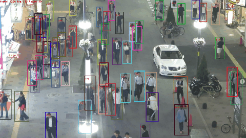
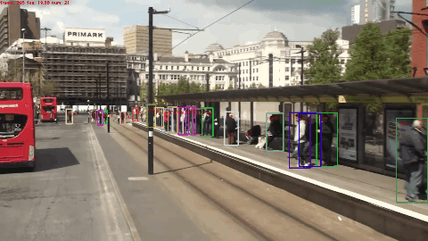
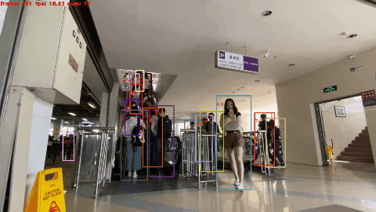
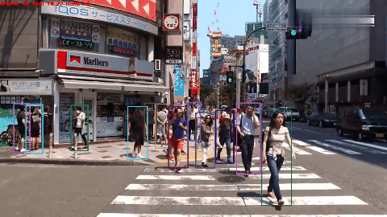

# Towards-Realtime-MOT
**NEWS:** 
- **[2020.01.29]** More models uploaded! The fastest one runs at around **38 FPS!**. 
- **[2019.10.11]** Training and evaluation data uploaded! Please see [DATASET_ZOO.md](https://github.com/Zhongdao/Towards-Realtime-MOT/blob/master/DATASET_ZOO.md) for details.
- **[2019.10.01]** Demo code and pre-trained model released!

## Introduction
This repo is the a codebase of the Joint Detection and Embedding (JDE) model. JDE is a fast and high-performance multiple-object tracker that learns the object detection task and appearance embedding task simutaneously in a shared neural network. Techical details are described in our [arXiv preprint paper](https://arxiv.org/pdf/1909.12605v1.pdf). By using this repo, you can simply achieve **MOTA 64%+** on the "private" protocol of [MOT-16 challenge](https://motchallenge.net/tracker/JDE), and with a near real-time speed at **22~38 FPS** (Note this speed is for the entire system, including the detection step! ) .

We hope this repo will help researches/engineers to develop more practical MOT systems. For algorithm development, we provide training data, baseline models and evaluation methods to make a level playground. For application usage, we also provide a small video demo that takes raw videos as input without any bells and whistles.

## Requirements
* Python 3.6
* [Pytorch](https://pytorch.org) >= 1.2.0 
* python-opencv
* [py-motmetrics](https://github.com/cheind/py-motmetrics) (`pip install motmetrics`)
* cython-bbox (`pip install cython_bbox`)
* (Optional) ffmpeg (used in the video demo)
* (Optional) [syncbn](https://github.com/ytoon/Synchronized-BatchNorm-PyTorch) (compile and place it under utils/syncbn, or simply replace with nn.BatchNorm [here](https://github.com/Zhongdao/Towards-Realtime-MOT/blob/master/models.py#L12))
* ~~[maskrcnn-benchmark](https://github.com/facebookresearch/maskrcnn-benchmark) (Their GPU NMS is used in this project)~~


## Video Demo
   
   

Usage:
```
python demo.py --input-video path/to/your/input/video --weights path/to/model/weights
               --output-format video --output-root path/to/output/root
```

## Docker demo example
```bash
docker build -t towards-realtime-mot docker/

docker run --rm --gpus all -v $(pwd)/:/Towards-Realtime-MOT -ti towards-realtime-mot /bin/bash
cd /Towards-Realtime-MOT;
python demo.py --input-video path/to/your/input/video --weights path/to/model/weights
               --output-format video --output-root path/to/output/root

```

## Dataset zoo
Please see [DATASET_ZOO.md](https://github.com/Zhongdao/Towards-Realtime-MOT/blob/master/DATASET_ZOO.md) for detailed description of the training/evaluation datasets.
## Pretrained model and baseline models
Darknet-53 ImageNet pretrained model: [[DarkNet Official]](https://pjreddie.com/media/files/darknet53.conv.74)

Trained models with different input resolutions:

|Model| MOTA | IDF1 | IDS | FP | FN | FPS | Link |
|-----|------|------|-----|----|----|-----|------|
|JDE-1088x608| 74.8|	67.3|	1189| 5558|	21505|	22.2| [[Google]](https://drive.google.com/open?id=1nlnuYfGNuHWZztQHXwVZSL_FvfE551pA) [[Baidu]](https://pan.baidu.com/s/1Ifgn0Y_JZE65_qSrQM2l-Q) |
|JDE-864x480| 70.8|	65.8|	1279|	5653|	25806|	20.3| [[Google]]() [[Baidu]](https://pan.baidu.com/s/1rBQ7DFjhLQbEq6JTJRntKA) |
|JDE-576x320| 63.7|	63.3|	1307|	6657|	32794|	37.9|[[Google]]() [[Baidu]](https://pan.baidu.com/s/1cCulbPNneIXOpRRjrTgJ4g) |

The performance is tested on the MOT-16 training set, just for reference. Running speed is tested on an Nvidia Titan Xp GPU. For a more comprehensive comparison with other methods you can test on MOT-16 test set and submit a result to the [MOT-16 benchmark](https://motchallenge.net/results/MOT16/?det=Private). Note that the results should be submitted to the private detector track.

## Test on MOT-16 Challenge
```
python track.py --cfg ./cfg/yolov3_1088x608.cfg --weights /path/to/model/weights
```
By default the script runs evaluation on the MOT-16 training set. If you want to evaluate on the test set, please add `--test-mot16` to the command line.
Results are saved in text files in `$DATASET_ROOT/results/*.txt`. You can also add `--save-images` or `--save-videos` flags to obtain the visualized results. Visualized results are saved in `$DATASET_ROOT/outputs/`

## Training instruction
- Download the training datasets.  
- Edit `cfg/ccmcpe.json`, config the training/validation combinations. A dataset is represented by an image list, please see `data/*.train` for example. 
- Run the training script:
```
CUDA_VISIBLE_DEVICES=0,1,2,3,4,5,6,7 python train.py 
```

We use 8x Nvidia Titan Xp to train the model, with a batch size of 32. You can adjust the batch size (and the learning rate together) according to how many GPUs your have. You can also train with smaller image size, which will bring faster inference time. But note the image size had better to be multiples of 32 (the down-sampling rate).

### Train with custom datasets
Adding custom datsets is quite simple, all you need to do is to organize your annotation files in the same format as in our training sets. Please refer to [DATASET_ZOO.md](https://github.com/Zhongdao/Towards-Realtime-MOT/blob/master/DATASET_ZOO.md) for the dataset format. 


## Acknowledgement
A large portion of code is borrowed from [ultralytics/yolov3](https://github.com/ultralytics/yolov3) and [longcw/MOTDT](https://github.com/longcw/MOTDT), many thanks to their wonderful work!
